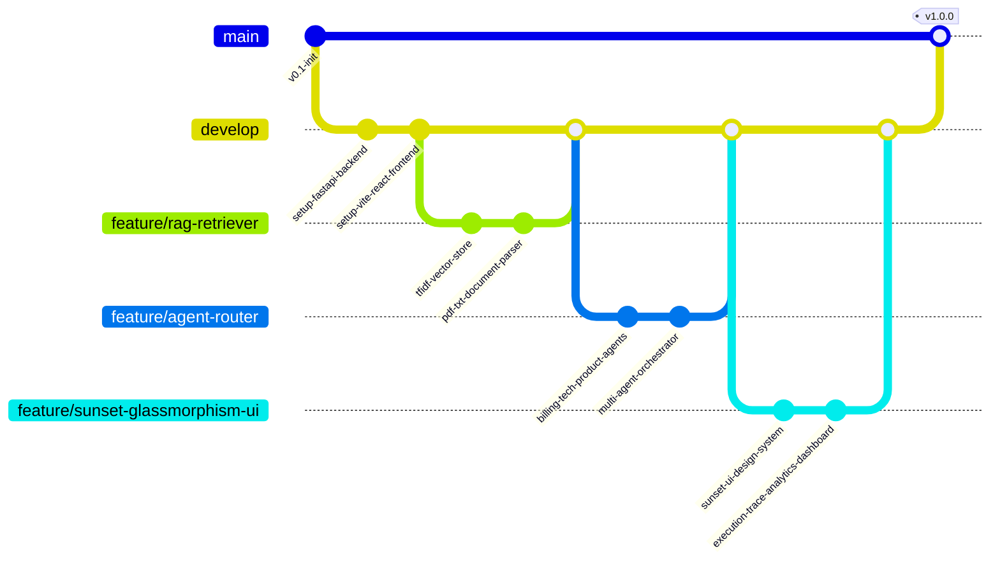
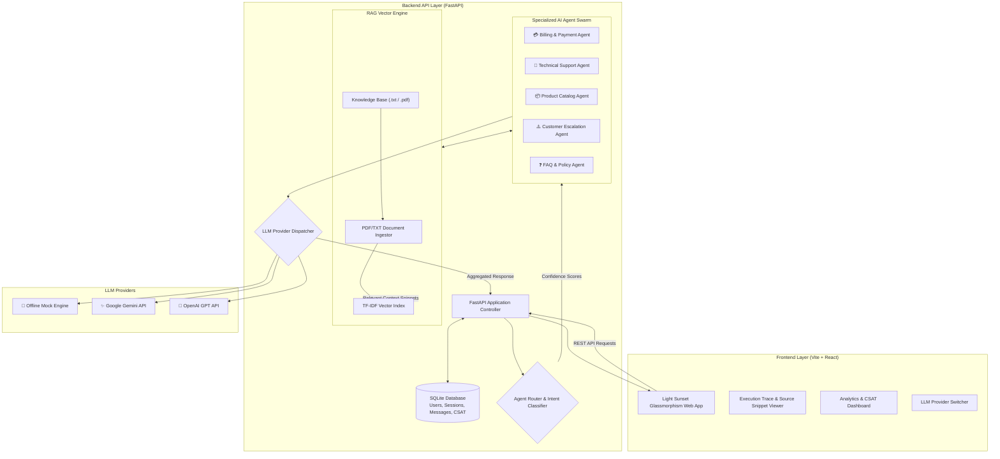

# 🤖 Multi-Agent AI Customer Support Assistant with RAG

[](https://www.python.org/)
[](https://fastapi.tiangolo.com/)
[](https://react.dev/)
[](https://vitejs.dev/)
[](https://www.sqlite.org/)
[](LICENSE)

An enterprise-grade, full-stack multi-agent AI customer support orchestrator powered by dynamic intent classification, hybrid RAG (Retrieval-Augmented Generation), self-contained SQLite state management, and a custom **Light Sunset Gradient Glassmorphism Web UI**.

---

## 📋 Table of Contents

- [Overview](#-overview)
- [Key Features](#-key-features)
- [Architecture & Git Workflow](#-architecture--git-workflow)
  - [Git Branching Strategy (GitGraph)](#git-branching-strategy-gitgraph)
  - [System Architecture Diagram](#system-architecture-diagram)
- [Agent Ecosystem](#-agent-ecosystem)
- [Tech Stack](#-tech-stack)
- [Project Directory Structure](#-project-directory-structure)
- [Getting Started](#-getting-started)
  - [Prerequisites](#prerequisites)
  - [Backend Setup](#backend-setup)
  - [Frontend Setup](#frontend-setup)
- [API Reference](#-api-reference)
- [Analytics & Execution Trace](#-analytics--execution-trace)
- [License](#-license)

---

## 🌟 Overview

Modern customer support requires immediate, accurate, and context-aware responses across varied domains such as billing, technical troubleshooting, product inquiries, customer complaints, and general policies.

This system solves complex support queries by routing incoming questions through a **Multi-Agent Orchestrator**. The orchestrator scores intent confidence and delegates sub-tasks concurrently to specialized AI agents. Each agent queries a local RAG vector engine to extract grounded facts from company manuals, policies, and product guides before synthesizing a helpful final answer.

---

## ⚡ Key Features

1. 🎯 **Dynamic Multi-Agent Routing**: Central orchestrator classifies queries via keyword heuristics and LLM intent scoring, supporting multi-department concurrent activation (e.g., Billing + Tech Support).
2. 📖 **Local RAG Vector Pipeline**: Automatic ingestion of `.txt` and `.pdf` files, TF-IDF vector indexing with custom stop-word filtering, and cosine similarity context matching.
3. 🔄 **Tri-Model LLM Engine**: Seamlessly switch between an **Offline Mock Engine** (zero API keys required), **Google Gemini API**, and **OpenAI GPT API** on the fly.
4. 🕵️ **Transparent Execution Trace**: Live visualization in the UI displaying confidence levels per agent, active routing decisions, and exact RAG source document snippets.
5. 📊 **Real-Time Analytics & CSAT**: Dashboard tracking agent hit frequencies, average query latency, and Customer Satisfaction (CSAT) ratings.
6. 🎨 **Premium Sunset Glassmorphism UI**: Built with React & Vite, featuring a light sunset gradient palette, glassmorphic cards, custom tabs, and responsive layouts.
7. 💾 **Self-Contained Persistence**: SQLite database handling user authentication, chat session management, message histories, settings, and agent metrics out-of-the-box.

---

## 🏗️ Architecture & Git Workflow

### Git Branching Strategy (GitGraph)

The repository follows a structured feature-branch workflow. Below is the commit and release history represented via GitGraph:



### System Architecture Diagram



---

## 🤖 Agent Ecosystem

| Agent Name | Icon | Focus Area | Key Capabilities |
| :--- | :---: | :--- | :--- |
| **Billing Agent** | 💳 | Payments & Subscriptions | Refunds, invoices, pricing tiers, payment processing queries |
| **Technical Support Agent** | 🔧 | Hardware & Software Setup | Connectivity, Wi-Fi configuration, firmware updates, hardware resets |
| **Product Agent** | 📦 | Product Catalog & Specs | Projectors, soundbars, light strips, hardware specifications, comparisons |
| **Complaint Agent** | ⚠️ | Customer Escalation | Handling dissatisfied feedback, damage reports, urgent escalations |
| **FAQ Agent** | ❓ | General Support & Policies | Operating hours, shipping guidelines, return windows, warranty details |

---

## 🛠️ Tech Stack

### **Backend Framework & Services**
- **Python 3.11+**: Primary backend language
- **FastAPI**: Asynchronous REST API framework
- **Uvicorn**: High-performance ASGI server
- **SQLite3**: Relational storage for users, sessions, and logs
- **pypdf & NumPy**: Document processing & matrix vector operations

### **Frontend Interface**
- **React 18**: UI component framework
- **Vite**: Rapid frontend build tool & server
- **Vanilla CSS**: Custom design system with glassmorphism CSS variables & light sunset gradients

---

## 📂 Project Directory Structure

```
Multi-Agent/
├── backend/
│   ├── agents/
│   │   ├── billing.py          # Billing & Payments Agent
│   │   ├── complaint.py        # Customer Complaint Agent
│   │   ├── faq.py              # FAQ & General Policy Agent
│   │   ├── product.py          # Product Catalog Agent
│   │   ├── technical.py        # Technical Support Agent
│   │   ├── router.py           # Intent Classification & Agent Router
│   │   └── llm.py              # Unified LLM Provider Dispatcher
│   ├── database/
│   │   └── database.py         # SQLite Database Schema & Helper Methods
│   ├── rag/
│   │   └── retriever.py        # Document Parser & TF-IDF Vector Store
│   └── main.py                 # FastAPI Application Server & Endpoints
├── frontend/
│   ├── public/                 # Static Assets
│   ├── src/
│   │   ├── App.jsx             # Main Glassmorphism UI Application
│   │   ├── App.css             # Component Styling & Micro-animations
│   │   ├── index.css           # Glassmorphism Design Tokens & CSS Variables
│   │   └── main.jsx            # React App Entrypoint
│   ├── package.json            # Node Dependencies & Scripts
│   └── vite.config.js          # Vite Configuration
├── knowledge_base/             # RAG Knowledge Sources (.txt, .pdf)
│   ├── faq.txt
│   ├── products.txt
│   ├── refund_policy.txt
│   ├── shipping_policy.txt
│   ├── user_manual.txt
│   └── warranty.txt
├── requirements.txt            # Python Dependencies
├── .gitignore                  # Git Exclusion Rules
└── README.md                   # Project Documentation
```

---

## 🚀 Getting Started

### Prerequisites

- **Python**: v3.11 or higher
- **Node.js**: v20 or higher
- **npm**: v9 or higher

---

### Backend Setup

1. **Navigate to the root directory**:
   ```bash
   cd Multi-Agent
   ```

2. **Create and activate virtual environment**:
   - **Windows (PowerShell)**:
     ```powershell
     python -m venv .venv
     .\.venv\Scripts\Activate.ps1
     ```
   - **Linux / macOS**:
     ```bash
     python3 -m venv .venv
     source .venv/bin/activate
     ```

3. **Install Python dependencies**:
   ```bash
   pip install -r requirements.txt
   ```

4. **Run the FastAPI server**:
   ```bash
   python -m uvicorn backend.main:app --host 127.0.0.1 --port 8000 --reload
   ```
   > The server will initialize `backend/database/db.sqlite3` and build the RAG vector index automatically at startup (`http://127.0.0.1:8000`).

---

### Frontend Setup

1. **Open a new terminal window** and navigate to the frontend folder:
   ```bash
   cd Multi-Agent/frontend
   ```

2. **Install Node modules**:
   ```bash
   npm install
   ```

3. **Launch Vite development server**:
   ```bash
   npm run dev
   ```

4. **Access the application**:
   Open your browser and navigate to: **`http://localhost:5173/`**

---

## 📡 API Reference

| Method | Endpoint | Description |
| :--- | :--- | :--- |
| `POST` | `/api/auth/register` | Register a new user |
| `POST` | `/api/auth/login` | Authenticate user & start session |
| `GET` | `/api/chat/sessions` | Fetch user chat sessions |
| `POST` | `/api/chat/sessions` | Create a new chat session |
| `DELETE`| `/api/chat/sessions/{id}` | Delete a chat session |
| `POST` | `/api/chat` | Send query, execute RAG & multi-agent pipeline |
| `GET` | `/api/settings` | Retrieve active LLM provider configuration |
| `POST` | `/api/settings` | Update LLM provider (Mock / Gemini / OpenAI) |
| `GET` | `/api/analytics` | Fetch agent execution counts, latency & CSAT |
| `POST` | `/api/knowledge/ingest` | Dynamically upload new documents to RAG index |

---

## 📊 Analytics & Execution Trace

The frontend web application provides real-time transparency into how each response is constructed:

- **Execution Trace Modal**: Inspect confidence ratings for each domain, see which agents were triggered, and view the precise text snippets retrieved from local documents.
- **Analytics Dashboard**: Monitor cumulative agent calls, average processing speed, and collect feedback ratings to continuously optimize knowledge base articles.

---

## 📄 License

This project is licensed under the [MIT License](LICENSE). Feel free to use, modify, and distribute it for personal and commercial applications.
